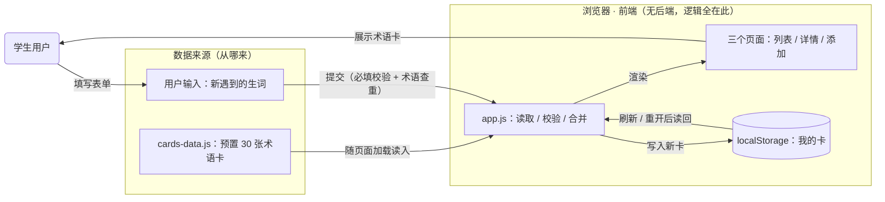

# TECH_DESIGN · BioTech English 技术设计

| 项 | 内容 |
|---|---|
| 产品名 | BioTech English（生物技术专业英语生词卡网站） |
| 文档版本 | v1.0 |
| 作者 | Keon2026 |
| 日期 | 2026-09-22 |
| 关联文档 | PRD v1.0（选型边界来自 PRD 第 6、8 节） |
| 状态 | ✅ 技术路线已确定，待 Day 6 开发实现 |

---

## 0. 一句话数据流（今日核心）

> **数据从两处来——随代码发布的预置术语卡（`cards-data.js`）和用户在表单里输入的生词；前端 JS 在浏览器里校验、合并后渲染成页面，用户自己的卡写进 localStorage 并在下次访问时读回——全部数据只在浏览器本地流转，不上传任何服务器。**

- 从哪来：① 预置卡（写在代码里，随页面加载）② 用户输入（添加表单提交）
- 到哪去：① 渲染成页面给用户看 ② 用户自己的卡存进 localStorage，刷新后还在
- 边界：数据不出浏览器——这与 PRD 第 8 节"不上传、无密钥"的隐私承诺一致

## 1. ① 前后端与数据库分工

**通用分工**：前端负责用户看到和点到的一切（页面、交互、校验）；后端负责服务器上的业务逻辑和接口；数据库负责长期、可靠地存取数据。

**本项目的分工**（呼应 PRD 第 6 节的取舍：不做账号体系、不做后端）：

| 角色 | 通用网站里做什么 | 本项目谁来做 | 说明 |
|---|---|---|---|
| 前端 | 页面展示、交互、表单校验 | 原生 HTML / CSS / JS | **承担全部功能**，因为没有后端 |
| 后端 | 业务逻辑、接口、登录鉴权 | ❌ 不设 | PRD 已砍掉；单人复习场景用不上，还能把 Day 6-7 的风险砍半 |
| 数据库 | 长期存取结构化数据 | **localStorage**（浏览器自带键值存储）+ `cards-data.js`（随代码发布的预置数据） | localStorage 满足 AC-7"刷新不丢"；预置卡直接写进 JS 文件，30 张卡无需任何安装 |

一句话：**这是一个"前端一人挑三担"的架构**——前端同时干了展示、逻辑和存储三份活，代价是数据只在这台浏览器里，收益是零服务器、零运维、零成本。

## 2. ② 技术路线（选型与理由）

**选定路线：原生 HTML + CSS + JavaScript 的纯静态多页站点，托管在 GitHub Pages。**

| 层 | 选择 | 为什么暂时选它 |
|---|---|---|
| 页面与逻辑 | 原生 HTML + CSS + JavaScript，3 个静态页面（列表 / 详情 / 添加表单） | ① PRD 第 8 节要求 clone 后直接打开即运行——原生方案零构建、零依赖，天然满足；② 零基础 + 单人 + 只有一天开发时间（Day 6），框架学习成本会直接威胁上线；③ 与现有占位页 `index.html` 同一套路，无需迁移 |
| 预置数据 | `cards-data.js`（JS 数组常量，≥30 张卡） | 数据就是代码的一部分，加载即用；改内容只动这一个文件 |
| 用户数据 | localStorage（仅存"我的卡"） | 满足 AC-7 刷新不丢；不上传服务器 = 零隐私风险、零密钥（PRD 第 8 节硬约束） |
| 托管 | GitHub Pages | 仓库已在 GitHub（Day 2 打通 push），开启 Pages 后 push 即上线，免费、免运维，Day 7 验收直接用它 |
| 样式 | 手写单个 `style.css`，媒体查询做响应式 | AC-9 只要求 375px 宽度可正常浏览，手写媒体查询足够；不引入框架减少一层学习成本 |

**明确不选的**（不是没想过，是暂时不配）：

- React / Vue 等框架：要装 Node 依赖、配构建工具，对一个 Day 6 就要交 F1-F3 的单人项目是纯风险；等卡片量、功能复杂度上来了再评估
- 任何后端（Node/Python 服务）与数据库（MySQL 等）：PRD 第 6 节已明确砍掉，触发条件（多设备需求被验证）未出现
- 第三方 CSS 框架、需要密钥的云服务：PRD 第 8 节明令不引入

## 3. ③ 数据流图

读图方式：一切箭头都发生在"浏览器"这个框里，唯一跨框的流量是 GitHub Pages 把 HTML/CSS/JS 文件送到浏览器（一次性加载，之后断网也能用本地已加载的页面逻辑）。

## 4. Day 6 文件规划（技术路线落到文件）

| 文件 | 职责 | 服务哪些验收项 |
|---|---|---|
| `index.html` | 首页：生词卡列表 + "添加生词卡"入口 | AC-1 / AC-2 / AC-6 |
| `card.html` | 详情页：6 项字段展示 + 返回入口 | AC-3 / AC-4 |
| `add.html` | 添加表单：必填校验 + 查重 | AC-5 / AC-8 |
| `style.css` | 全站样式 + 375px 响应式 | AC-9 |
| `app.js` | 读取 / 校验 / 合并 / 渲染逻辑 | AC-5 ~ AC-8 / AC-10 |
| `cards-data.js` | 预置 ≥30 张术语卡数据 | AC-1 |

## 5. 余力加练：方案变化时哪些文件会受影响

> 回答"如果选型变了，要动哪些文件"——这也是检验今天技术路线是否清晰的标尺：路线清楚，影响范围才算得清。

| 如果方案变成… | 受影响文件 | 影响原因 |
|---|---|---|
| 换成 Vue / React 框架 | 全部 3 个 html + `app.js` 重写；新增 `package.json`、构建配置 | 页面组件化 + 引入构建工具链，工作量≈重做 Day 6 |
| 用户卡从 localStorage 改存云端 | `app.js`、`add.html`；新增后端代码与 `.env` 密钥配置 | 存储从浏览器换到服务器，PRD 第 6/8 节两条约束同时被推翻 |
| 预置卡内容增删改 | 仅 `cards-data.js` | 预置数据集中在单文件，这是把它独立出来的原因 |
| 改配色 / 布局 | `style.css`（偶尔波及 html 里的 class 名） | 样式与结构分离，集中在单文件 |
| 加 F4 筛选 / F5 删除（P1） | `index.html` + `app.js`（删除另动 `card.html`） | 列表页交互扩展，不动数据层 |

## 6. 与里程碑对齐

| 天 | 任务 | 与本文档的关系 |
|---|---|---|
| Day 6 | 开发实现 F1-F3 | 按第 4 节文件规划写代码 |
| Day 7 | 上线验收 | 仓库 Settings 开启 GitHub Pages，按 PRD 第 9 节 AC-1 ~ AC-10 逐条验收 |
